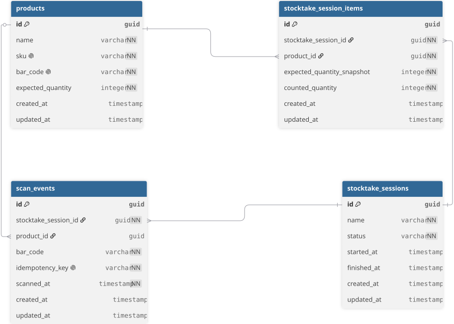

# Stocktake API

REST API in C#/.NET for physical inventory counts (stocktake) via Bar Code scanning.

## About

Service to register products, open a counting session, and let operators scan Bar Codes on physical items, reconciling what was counted against what the system expects.

**Some concepts and features was not impleted yet, this README describes what the project is supposed to do.**

## Business rules

- Idempotency is the core mechanic: every scan carries a client-generated `IdempotencyKey`. Resending the same key in the same session returns the same result as the first call, without incrementing the count.
- A Bar Code that isn't in the catalog is not an error. The scan is accepted normally and shows up in the final report as `Unknown`.
- Different scans of the same Bar Code accumulate normally (5 valid reads = count of 5). Only a repeated idempotency key gets deduplicated.
- Only one `InProgress` session can exist at a time.
- Closing a session locks further scans and triggers reconciliation, classifying each item as:
  - `Match`  - counted equals expected
  - `Shortage`  - counted is less than expected
  - `Surplus`  - counted is more than expected
  - `Unknown`  - Bar Code with no matching product in the catalog

## Requirements

### Functional requirements

- Register a product with `Sku`, `BarCode`, `Name`, and `ExpectedQuantity`
- List the product catalog, paginated
- Open a stocktake session, only one allowed `InProgress` at a time
- Register a scan with a client-generated `IdempotencyKey`, safely retryable without duplicating the count
- Accept scans for a `BarCode` not present in the catalog instead of rejecting them
- Close a session, which locks further scans and generates the reconciliation report
  
### Non-functional requirements

- REST conventions, URL versioning (`/api/v1/`)
- Error responses follow a single consistent shape, regardless of endpoint
- Correct HTTP status codes
- `IdempotencyKey` validated at the application layer and also enforced with a unique database constraint (`StocktakeSessionId` + `IdempotencyKey`), don't rely on application-layer validation alone
- There can only be one count per product in the stocktake session

## Stack

- C# / .NET
- ASP.NET Core
- Entity Framework Core
- CQRS (commands/queries separated)
- xUnit, FluentAssertions, Moq

## Architecture

Clean Architecture, dependencies always pointing inward:

```
Stocktake.Domain
Stocktake.Application
Stocktake.Infrastructure
Stocktake.API
```

## Database



## Running locally

Needs the [.NET SDK](https://dotnet.microsoft.com/download) installed.

```bash
git clone https://github.com/KayronJ/stocktake-api.git
cd stocktake-api
dotnet restore
dotnet run
```

API comes up at `https://localhost:{port}/api/v1/`.


## Testing

Coverage that needs to exist before this is considered done:

- Resending the same `IdempotencyKey` doesn't duplicate the count and returns the original result
- Unknown `BarCode` is accepted and shows up as `Unknown` in the report
- Only one `InProgress` session at a time; scanning after close is rejected
- Each report classification tested in isolation, including edge cases (e.g. counted == expected, counted == expected - 1)
- End-to-end integration test: 
  - register product
  - open session
  - scan
  - resend same key (no duplication) 
  - scan unknown code 
  - close 
  - check report 

## License
